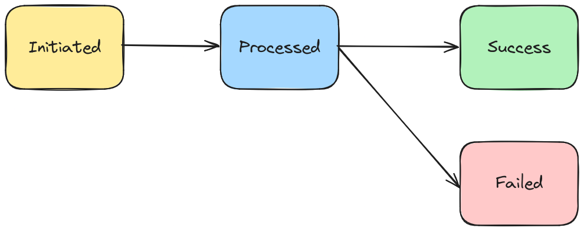
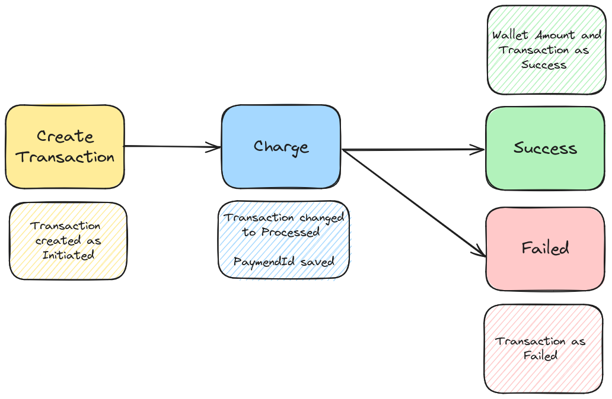

# Wallet Kata

This Kata implements a simple Wallet service.

Index:

* [Problem definition](./doc/PROBLEM.md)
* [Introduction](#introduction)
    * [How to run](#how-to-run)
    * [CI/CD](#cicd)
* [Solution](#solution)
    * [Architecture](#architecture)
    * [Security](#security)
    * [Scalability and concurrency](#scalability-and-concurrency)

# Introduction

The objective of this solution is to build a simplified service for managing a Wallet system.
The endpoints included:

* Create wallet (not in the requirements but implemented for easier testing and realism)
* Top-Up providing a Wallet, Amount, and CardNumber
* Get Wallet information

Based on the code provided, I decided to use the **SQL version** and followed a layered structure
similar to the one you provided with the existing code.

## How to run

To simplify the execution in different environments and avoid the dependency on Java and Maven of
your computer or environment, I've prepared a Makefile that only requires Docker.

Prerequisites:

- Make
- Docker

This Makefile supports the following commands:

* `make dev`: Starts the application at [http://localhost:8090](http://localhost:8090)
* `make test`: Executes all the tests, both unit and integration
* `make test-unit`: Executes only the unit tests
* `make test-class`: Executes only the tests of a specific class
* `make api-spec`: Generates the OpenAPI specification
  at [http://localhost:8888](http://localhost:8888)

Even with the make commands ready to simplify your work, you can still use Maven or your IDE to
execute the application or run the tests.

## CI/CD

To simplify the process during development and detect potential errors as soon as possible, I've
added a GitHub Action that executes all the tests each time the code is pushed.

# Solution

Based on my experience with Layered Architecture and Hexagonal Architecture + DDD, I've decided to
go with Layered Architecture focusing on the simplicity and readability of this small kata.

The implementation of the solution has been done following [ATDD](./doc/images/atdd.png) (Acceptance
Test Driven Development). ATDD consists of creating an Acceptance Test covering a basic feature to
implement, and then using TDD to build the feature with Unit Tests. Following this approach helped
me to build the Kata with all the code covered by Unit and Acceptance (Integration) tests.

## Architecture

The implementation of the solution is based on a Layered Architecture.

The application is divided into two packages and a shared package:

* `stripeclient`: contains all features related to the Stripe connection (charge, refund)
* `wallet`: contains all features related to the Wallet (create, top-up, get)
* `shared`: contains infrastructure needed related to the application (generic exception handlers)

The layers defined in the production code are:

* api: contains the HTTP communication
* service: contains the business logic
* repository: contains the data access
* dto: contains the data transfer objects
* exception: contains the errors or exceptions
* infrastructure: contains the configuration or handlers

For the tests, I've used the same structure as the production code but adding:

* fakes: contains fake implementations

All the communication between modules is done by the services (and DTOs) to reduce the coupling
between modules. This could be useful in the future in case that we want to split the application
into multiple services, with that, changing the call to the service to an HTTP call will be easy
because the information used will be the same.

### StripeClient

I did change a little bit the structure of the provided code of the StripeService to allow me to
create more robust tests.

* Created a package `stripeclient` that contains all the code related to the StripeClient
* Extracted the `ChargeRequest` from the `StripeService`. This was important because it allowed me
  to make the unit tests more robust because I could validate the parameters of the API call. I
  suppose that the objective of having it internally is because we don't want anyone from outside
  the module to use this DTO, but I've prioritized the testability.
* Created different layers to structure the information

I've created two fakes for the testing:

* FakeStripeController: used in the `test-stripe` profile, it simulates the behavior of the
  simulated Stripe server. It allowed me to create Integration Tests to test the behavior of the
  StripeService.
* FakeStripeService: used in the `test` profile, it is a simplification of the StripeService. Using
  the same port for all the tests was giving me an error in the tests, so I couldn't use the
  StripeService implemented in this project because the URL is from the configuration. When you put
  a RANDOM_PORT in the tests executions, you cannot set the port used in a configuration. So, in
  order to be able to implement Integration Tests for Wallet, I created a simplified fake version of
  StripeService.

We could avoid creating the FakeStripeController and FakeStripeService, having an external service
running in a lightweight Docker in the local environment could allow using the URL in the
configuration, so all the Integration Tests that interact with Stripe will use the StripeService
implementation and not the fake.

### Wallet

For the Wallet, I've created the next models:

* Wallet: contains the information of the Wallet
* Transaction: belongs to a Wallet and contains the information of the Transaction

#### Transaction Flow

For the Transactions, I've defined a flow with different statuses in order to make it more real and
robust. In production, it is very useful to have a transaction flow to recover in case of any error,
also to have observability of the progress of the transaction, or allows to make async processes,
like for example, create the transaction in the top-up call, but execute the charge in a background
process.

Transaction flow:

* **INITIATED**: Just when the Transaction is created. It has defined the Wallet to who belongs, and
  the amount.
* **PROCESSED**: Once the Transaction is processed in the payment provider but not yet in the
  Wallet. It has the Wallet to who belongs, the amount, and the PaymentId.
* **SUCCESS**: After being processed by the payment provider, the Transaction is marked as SUCCESS.
  The Wallet amount **is updated in the same transaction is updated to ensure the consistency of the
  data**.

  

This shows the top-up flow with the transaction status changes:

  

### API

The Wallet service exposes the following endpoints:

- **Create Wallet**: `POST /v1/wallets` - Creates a new wallet.
    - **userId**: The ID of the user that owns the wallet.
- **TopUp Wallet**: `POST /v1/wallets/{id}/actions/topup` - Adds funds to a wallet.
    - **cardNumber**: The credit card number associated with the wallet.
    - **amount**: The amount to be added to the wallet.
- **Get Wallet Info**: `GET /v1/wallets/{id}` - Retrieves information about a wallet.

You can see the specification with the Swagger UI using this command:

* `make api-spec`: Generates the OpenAPI specification
  at [http://localhost:8888](http://localhost:8888)

For detailed yml with API specifications, refer to the [API specification](./doc/api.yml).

In the past, I've used dependencies to implement the API documentation in the code, but it is too
verbose. You can generate an interface with the definition and then have the implementation clean,
but I think that will complicate the readability for this kata.

## Security

As not requested, no user-based authentication or authorization is implemented. However, for a
production application, you could consider using Spring Security to secure your endpoints.

Spring Security can help you implement authentication (using JWT tokens or OAuth2) and
authorization (role-based) to ensure that only authorized users can access certain endpoints.

All database interactions in this application are protected against SQL injection by using the ORM,
which prevents direct execution of SQL queries with user-provided data, ensuring that all data
access operations are safe and secure.

## Scalability and concurrency

With the current implementation in terms of concurrency and scalability:

### Concurrent top-ups

The process of the top-up reads the current wallet amount and updates it by adding the top-up
amount. In these cases, two top-ups executed concurrently could cause the second top-up to use an
outdated amount.

To solve this problem, I've implemented the `version` in the Wallet (optimistic locking). This
implies that when the second top-up is executed, in case that the wallet is updated between the read
and the write, the update will fail with an optimistic locking exception.

In case of an optimistic locking exception, the process will read the wallet's current values and
will retry the process up to 3 times.

### Inconsistencies between Wallet and Transaction

To avoid inconsistencies between the Wallet and the Transaction, the Wallet amount and the
transaction SUCCESS status are updated in the same transaction.

### Multiple user wallets

Solved with a unique key in the wallet.

### Missing transaction ID

With the current solution, it can happen that the top-up is initiated, the charge in Stripe is done,
but for some reason, the PaymentID is not saved in the Transaction (DB connection problems, out of
memory, process killed, ...).

This will cause us to not be able to link the payment charge and the information that we have in the
database.

Most providers offer two solutions (or at least one of the two):

* You "prepare" the payment, and the provider gives you the `payment_id`, so you can link it before
  doing the payment.
* You can provide your `order_id` to the payment, so you can link the payment and your transaction.

Using one of the two solutions would solve the problem.

### Transactions Conciliation

For any reason, during the top-up process can be interrupted and not completed totally, and with the
current implementation this can happen.

The solution could be a reconciliation process to try to recover the transaction and continue with
the process, or a mixed system to notify us to review the problem. In this case, it would be very
useful to implement the commented about the possibility to link the Transaction with the provider
from the beginning, because with this, most of the errors could be solved automatically as we would
have all the information to make programmatic validations with the Payment Provider.

### Performance

The indexes of the database currently are the needed ones:

* Wallet: id (primary), userId (unique)
* Transaction: id (primary), walletId (foreign)

### Error handling

Right now **all the errors from the DB or the StripeService are handled**. To simplify the
management in the controller, the error responses are managed by the 'infrastructure' layer in the
GlobalExceptionHandler.

### Potential Improvements

* Add more observability parameters like `createdAt` or `updatedAt`.
* Split the WalletService into a service by use case to segregate the logic and tests in smaller
  classes.
* Error handling in case we want it to be more fine-grained.
* Create MotherObjects to simplify the tests and reduce duplicated mother functions between test
  classes.
* Add more information in the transaction, like a TransactionType to distinguish between top-ups and
  the different purchases.
* Add more features like getting the Transactions of a wallet paginated.
